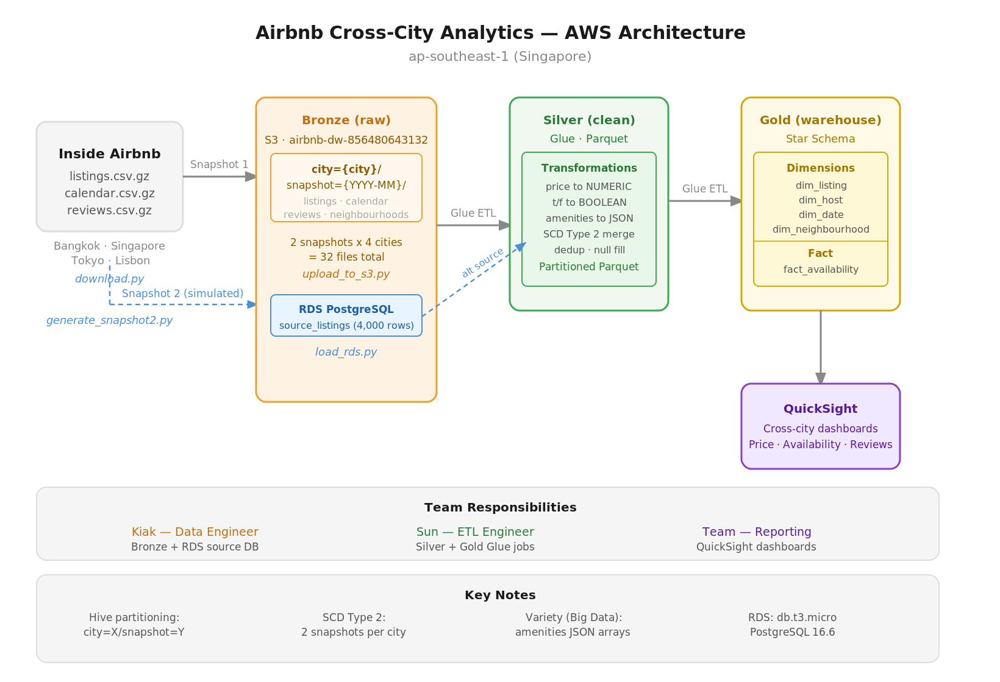

# Airbnb Cross-City Analytics — Data Warehouse

University group project: an end-to-end data warehouse for Airbnb listings across Bangkok, Singapore, Tokyo, and Lisbon — built on AWS with S3 Medallion architecture, Glue ETL, RDS PostgreSQL, and QuickSight.

---

## Architecture



| Layer | Technology | Purpose |
|-------|-----------|---------|
| Source | Inside Airbnb CSVs | Raw listing, calendar, review data |
| Bronze | S3 `raw/` (Hive-partitioned) | Immutable raw zone |
| Silver | S3 `cleaned/` (Parquet) | Cleaned, typed, deduplicated |
| Gold | S3 `warehouse/` + RDS | Star schema — dims + facts |
| BI | QuickSight | 3 dashboards for analytics |

---

## Team

| Person | Role | Score Ownership |
|--------|------|----------------|
| **Kiak** | Data Engineer / Source DB Lead | Data Source (2%) + Automation (1%) |
| **Sun** | ETL Engineer / DW Designer | DW & ETL (4%) |
| **Pluck** | Big Data / Lake Architect | Big Data (4%) + Automation support |
| **Jop** | BI Analyst / QuickSight Lead | BI Dashboards (4%) |

Presentation (5%) shared: Kiak + Sun → Video 1 · Pluck + Jop → Video 2.

---

## Phase Tracker

See [CLAUDE.md](CLAUDE.md) for the full phase tracker and task completion log.

**Current status (2026-05-08):** Phases 1–6 + Kiak automation complete. Phase 7 (Pluck — S3 lake zones + Glue Crawlers) is next.

---

## Repository Structure

> **Keep this section up to date.** When you add or remove a file, update this tree before committing.

```
airbnb-dw/
├── download.py              # Phase 1 — download raw CSVs from Inside Airbnb
├── generate_snapshot2.py    # Phase 2 — simulate 6-month mutations for SCD Type 2
├── upload_to_s3.py          # Phase 3 — upload raw/ to S3 with Hive partitioning
├── load_rds.py              # Phase 5 — load 1,000 rows/city into RDS source_listings
├── glue_rds_export.py       # Kiak-A — Glue Python Shell job (S3 Bronze → source-exports)
├── setup_glue_job.py        # Kiak-A — provisions Glue job + daily 02:00 UTC trigger
└── raw/                     # Local only — gitignored (1.1 GiB). Structure:
    └── {city}/{snapshot}/
        ├── listings.csv.gz
        ├── calendar.csv.gz
        ├── reviews.csv.gz
        └── neighbourhoods.geojson
diagram/
├── architecture.svg
└── architecture.png
handoff.md                   # Phase 6 handoff doc for Sun (ETL engineer)
CLAUDE.md                    # Claude Code briefing file — phase tracker, gotchas, AWS infra
README.md                    # This file — human overview, keep repo structure in sync
Inside Airbnb Data Dictionary.xlsx
```

---

## Quick Start

### Prerequisites

```bash
pip install pandas numpy boto3 psycopg2-binary openpyxl requests
aws sso login   # re-authenticate if session expired
```

### Run each phase

```bash
cd .\airbnb-dw

# Phase 1 — download raw data
python download.py

# Phase 2 — generate Snapshot 2
python generate_snapshot2.py

# Phase 3 — upload to S3
python upload_to_s3.py

# Phase 5 — load into RDS (RDS must be running first)
python load_rds.py
```

### Start / stop RDS

```bash
# Start
aws rds start-db-instance --db-instance-identifier airbnb-source-db --region ap-southeast-1

# Stop (save cost)
aws rds stop-db-instance --db-instance-identifier airbnb-source-db --region ap-southeast-1
```

---

## Cities & Snapshots

| City | Snapshot 1 | Snapshot 2 (simulated) |
|------|-----------|----------------------|
| Bangkok | 2025-09 | 2026-03 |
| Singapore | 2025-09 | 2026-03 |
| Tokyo | 2025-09 | 2026-03 |
| Lisbon | 2025-12 | 2026-03 |

Snapshot 2 applies controlled mutations (price drift, superhost flips, room type changes) to drive SCD Type 2 slowly-changing dimensions. See `CLAUDE.md` for exact rates.

---

## Data Quality Notes

| Field | Raw format | ETL fix |
|-------|-----------|---------|
| `price` | `"$1,595.00"` | Strip `$`/`,`, cast to NUMERIC |
| `host_is_superhost` | `"t"` / `"f"` | Map to boolean |
| `host_response_rate` | `"95%"` | Strip `%`, cast to FLOAT |
| `amenities` | JSON string | Parse as array |
| `host_verifications` | JSON string | Parse as array |

> **Schema drift:** Singapore CSVs include a `host_profile_id` column absent from other cities. ETL jobs must normalise to a fixed schema.

---

## AWS

- **Account:** `856480643132` · **Region:** `ap-southeast-1`
- **S3 bucket:** `airbnb-dw-856480643132`
- **RDS:** `airbnb-source-db` (PostgreSQL 16.6, db.t3.micro) — **currently stopped**
- **Auth:** AWS SSO (`aws sso login`)

See `CLAUDE.md` for RDS connection details, security group setup, and full command reference.

---

## Handoff

`handoff.md` contains Sun's onboarding guide: S3 file inventory, RDS connection, SCD Type 2 design, and expected Silver/Gold architecture.
